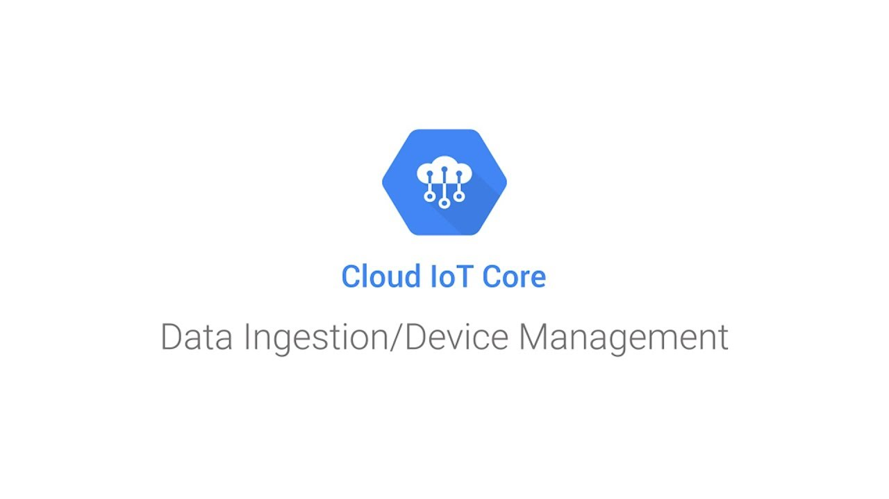

# Premiers pas avec un microcontrôleur et Google Cloud IoT Core

## Cartouche d'identification

 - Manifestation : CodeursEnSeine 2019
 - Lieu : Kindarena - Palais des sports de Rouen
 - Conférence : Premiers pas avec un microcontrôleur et Google Cloud IoT Core
 - Horaire de la conférence : 10h00
 - Durée de la conférence : 1h
 - Conférencier :
   - Gautier Mechling (https://twitter.com/Nilhcem : Twitter, https://github.com/Nilhcem : GitHub)
 - Mots-clés
 - URL de l'illustration : 
   - quelques sources : https://unsplash.com, https://xkcd.com/, http://dev.to/rly, ...

## Support
 - Lien vers le support (diapos) présenté en conférence
 - Nombre de diapos du support :
 - Plan du support :

## Résumé
...

## Architecture et facteur qualité
...
